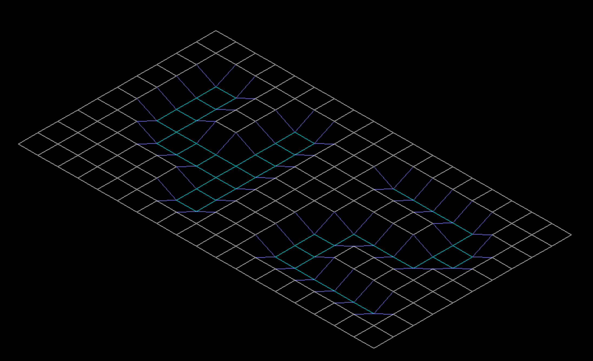
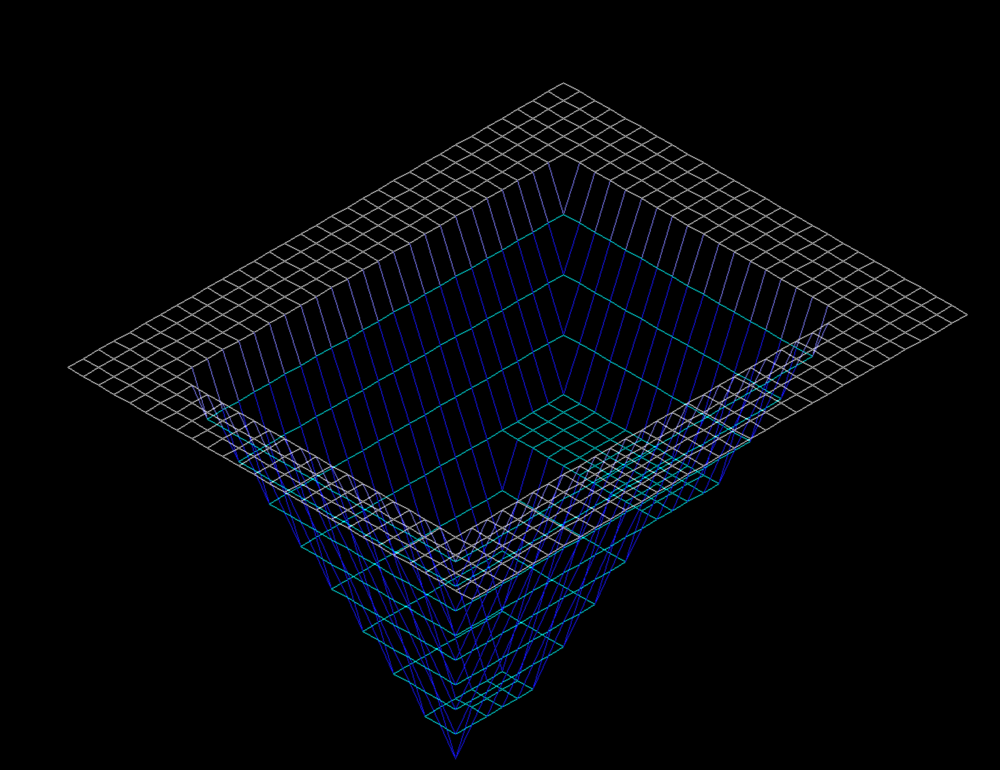
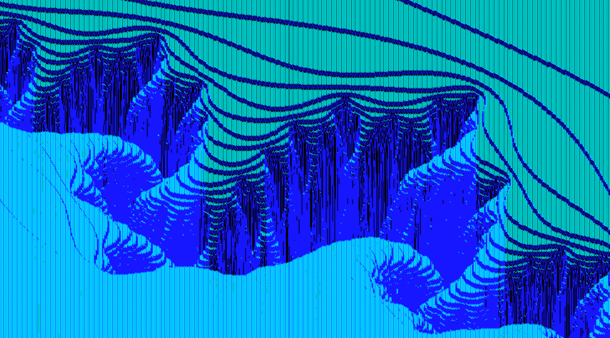
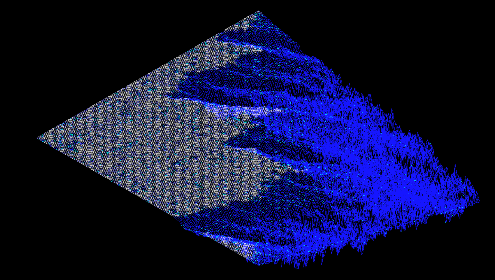

# 
FDF - Wireframe model

## Description

This project is about creating a simple wireframe model representation of a 3D land-scape by linking various points (x, y, z) thanks to line segments (edges). For this project, Bresenham's line algorithm is used. Also 42 school's own graphical library MiniLibX is used here to open a window, create images and deal with keyboard and mouse events.

 

## Language used

 

## Usage
**1- To compile the programme:**

    Make

**2- Run program:**

The coordinates of the landscape are stored in a .fdf file passed as a parameter. For example:

	./fdf test_maps/42.fdf
	./fdf test_maps/mars.fdf

**2- Keyboard and mouse actions:**

+ Press "+" to zoom in.
+ Press "-" to zoom out.
+ Press ESC to close the window.
+ Mouse wheel scroll up to zoom in.
+ Mouse wheel to scroll down to zoom out.
+ Click on the cross on the window's frame to close the window.

## Images

## External resources

+ [Bresenham's line algorithm](https://en.wikipedia.org/wiki/Bresenham%27s_line_algorithm)
+ [MiniLibX documentation by Gontjarow](https://gontjarow.github.io/MiniLibX/)
+ [MiniLibX documentation by Harm Smits](https://harm-smits.github.io/42docs/)
